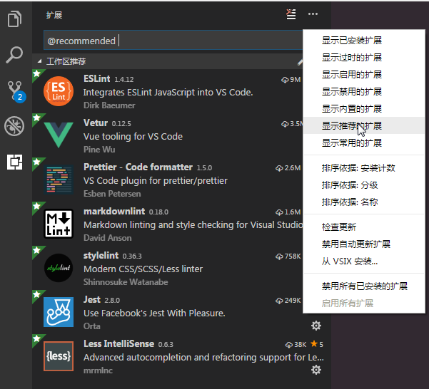

# 编辑器

## Visual Studio Code

[https://code.visualstudio.com](https://code.visualstudio.com)

本项目推荐使用 VS Code 进行开发，因为在 `.vscode` 目录中已包含本项目的一些推荐扩展以及项目内推荐的编辑器配置。

### .vscode/extensions.json

包含本项目所推荐的扩展插件，可在初次打开项目时提示项目推荐扩展，或者在“扩展”面板中，打开右上角的 “[显示推荐的扩展](https://code.visualstudio.com/docs/editor/extension-gallery#_workspace-recommended-extensions)” 菜单来安装本项目所建议安装的扩展。

其中包括：

- vetur （`.vue` 文件辅助扩展）
- prettier-vscode （代码格式化）
- stylelint （CSS/Less 样式规范辅助）
- vscode-eslint （JavaScript 脚本规范辅助）
- vscode-markdownlint （Markdown 规范辅助）
- vscode-less （Less 支持）
- vscode-jest （Jest 支持）

### .vscode/settings.json

仅作用于本项目内的 VS Code 编辑器配置项，具体内容可查看文件内各配置项自带说明。
